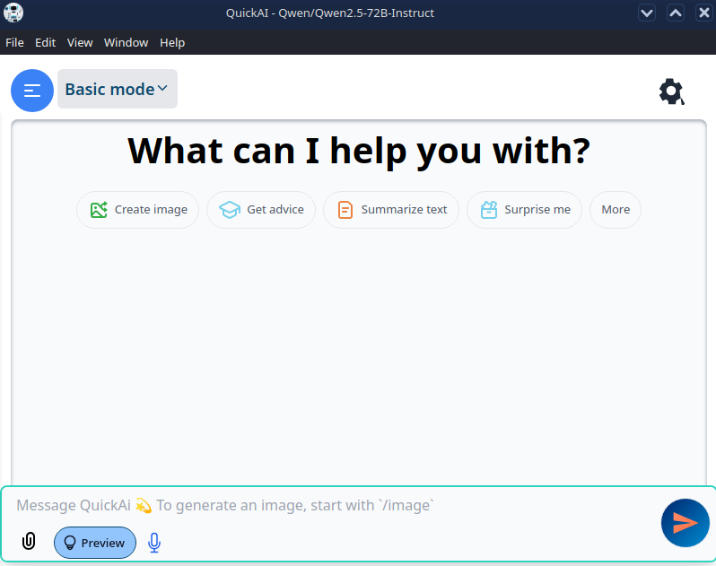
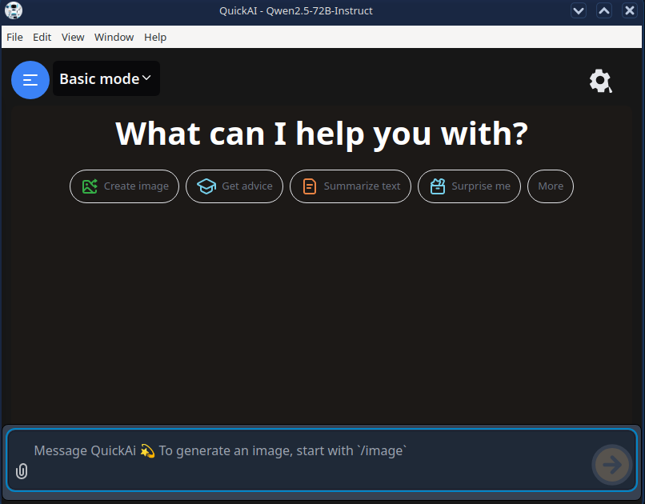
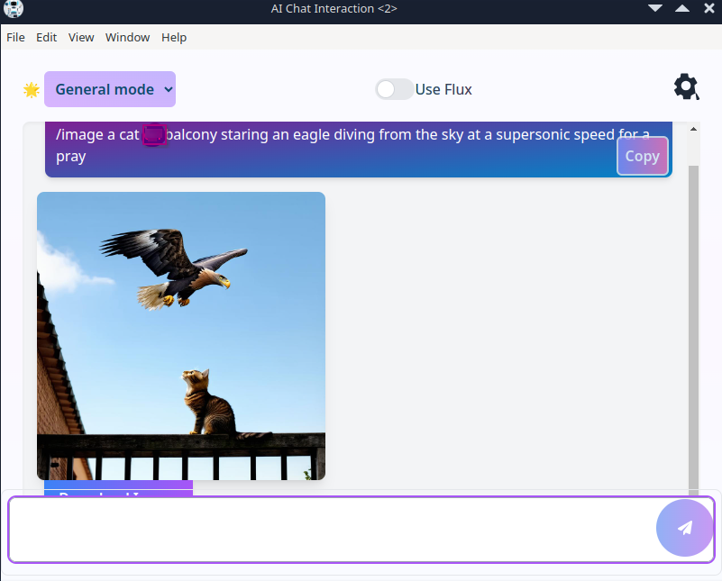
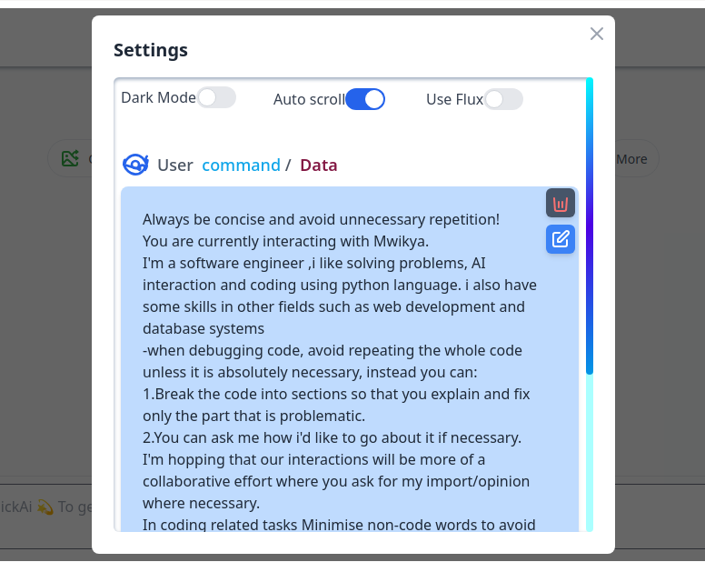

# QuickAi

## About

QuickAi is a powerful and versatile AI application designed to assist with a variety of tasks. It leverages advanced machine models to provide accurate and efficient solutions. Whether you are building a new application or integrating AI capabilities into an existing project, QuickAi is here to help.

## Capabilities

- **Natural Language Processing (NLP):** Understand and generate human-like text.
- **Image Recognition:** Identify and classify objects within images.
- **Image Generation:** Can Generate Images of your liking.
- **Data Analysis:** Process and analyze large datasets to extract meaningful insights.
- **Machine Learning:** Can help you Train and deploy custom machine learning models.
- **API Integration:** Easily integrate with other services and platforms.

## Repository
You can find the source code for QuickAi at the following URL:
- [https://github.com/skye-cyber/QuickAi.git](https://github.com/skye-cyber/QuickAi.git)
- Then ``bin`` branch hosts some prebuild releases for various platforms.

## Getting Started

### Cloning the Repository

To get started with QuickAi, first clone the repository to your local machine:

```bash
git clone https://github.com/skye-cyber/QuickAi.git
cd QuickAi
```
### Building the App
To build the application, run the following command:

```bash
npm run dist
```

### Running the App Without Building
To run the application directly without building it, use the following command:

```bash
npm start
```

## Interface
### Light mode

### Dark Mode

### Image Generation

### Settings


## Operational Parameters
# System Requirements:
- Node.js v20.18 or higher
- npm v10.9.0 or higher
- Python 3.8 (for some optional features)
- RAM atleast 2GB
- Storage atleast 4GB

## Contribution
We welcome contributions from the community! If you have ideas for improvements or new features, feel free to open an issue or submit a pull request.

## License
This program is free software: you can redistribute it and/or modify
    it under the terms of the GNU General Public License as published by
    the Free Software Foundation, either version 3 of the License, or
    (at your option) any later version.

    This program is distributed in the hope that it will be useful,
    but WITHOUT ANY WARRANTY; without even the implied warranty of
    MERCHANTABILITY or FITNESS FOR A PARTICULAR PURPOSE.  See the
    GNU General Public License for more details.

    You should have received a copy of the GNU General Public License
    along with this program.  If not, see <https://www.gnu.org/licenses/>.
    
  See the LICENSE file for more details. See the [LICENSE](LICENSE) file for details.

## Contact
If you have any questions or need further assistance, please contact us at:

- **Email:** [swskye17@gmail.com](mailto:swskye17@gmail.com)
- **GitHub:** [skye-cyber](https://github.com/skye-cyber)

Thank you for using QuickAi!
