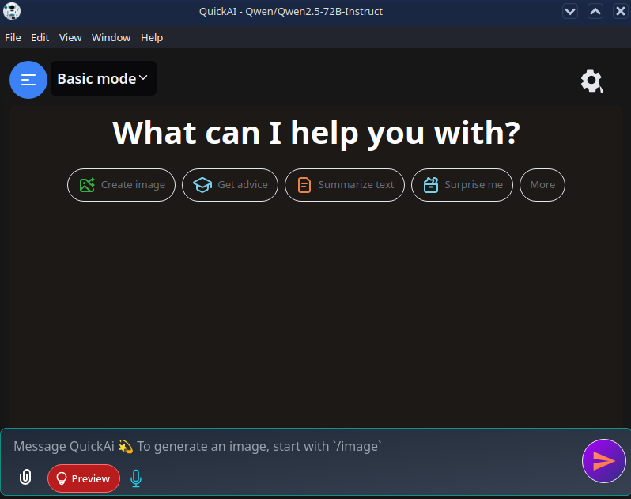
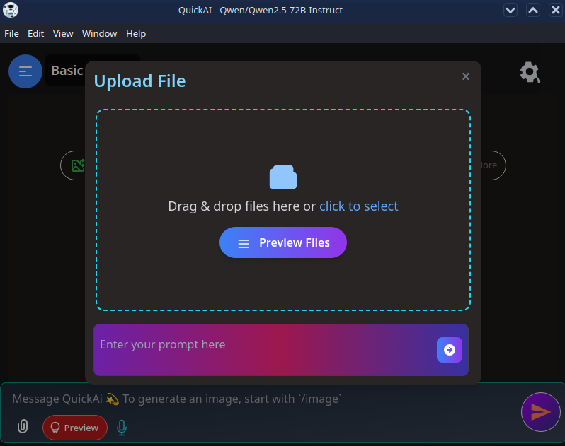
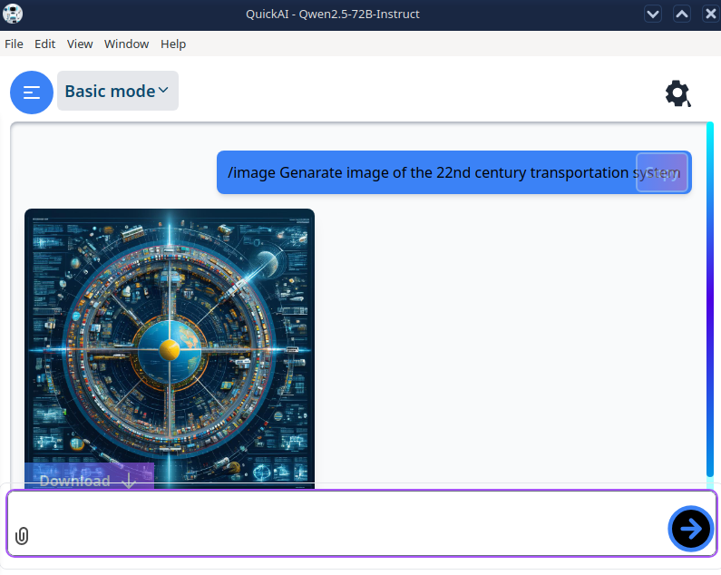

<!-- Main badges for Electron/JS app -->
[](https://opensource.org/licenses/GPL-3.0)
[](https://nodejs.org/)
[](https://www.electronjs.org/)
[](https://github.com/skye-cyber/UBookDesktop/actions)
<!-- Optional: If Python is a significant part of the app 
[](https://www.python.org/)-->

# QuickAi

## About

QuickAi is a versatile AI application that integrates advanced machine learning models from Hugging Face and Mistral to assist with tasks such as Natural Language Processing (NLP), Image Recognition, Image Generation, Data Analysis, and Machine Learning. Users can choose to utilize either or both models based on their requirements.

## Features

- **Dual Model Support:** QuickAi supports models from both Hugging Face and Mistral. Users can select their preferred model for each task, tailoring the application to their needs.

- **API Key Management:** To use QuickAi, users must provide API keys for the selected models. The application utilizes `keytar` to securely store and manage these keys in the system's keychain.

- **User Interface Themes:** QuickAi offers both Light and Dark modes. Users can switch between themes from the settings panel to suit their preferences.

- **Customizable Settings:** Within the settings panel, users can enable features like auto-scrolling of AI outputs and set custom instructions to personalize the AI's responses.

- **Model Switching:** Users have the flexibility to switch between different models for tasks like image generation. For instance, QuickAi supports the FLUX.1 model from Hugging Face. [FLUX.1 on Hugging Face](https://huggingface.co/black-forest-labs/FLUX.1-dev)

## Repository

The source code for QuickAi is hosted on GitHub:

- [QuickAi GitHub Repository](https://github.com/skye-cyber/QuickAi.git)

The `bin` branch contains pre-built releases for various platforms.

## Getting Started

### Prerequisites

Ensure your development environment includes the following:

- **Node.js:** Version 20.18 or higher
- **npm:** Version 10.9.0 or higher
- **Python:** Version 3.8 (required for certain optional features)
- **RAM:** Minimum of 2GB
- **Storage:** Minimum of 4GB

### Installation

1. **Clone the Repository:**

   ```bash
   git clone https://github.com/skye-cyber/QuickAi.git
   cd QuickAi
   ```

2. **Install Dependencies:**

   For Node.js dependencies:

   ```bash
   npm install
   ```

   <!--
   For Python dependencies (if applicable):

   ```bash
   pip install -r requirements.txt
   ```
   -->

### Building the Application

To build the application for your platform, execute:

```bash
npm run dist
```

This command packages QuickAi for your operating system, creating an executable in the `dist` directory.

### Running the Application Without Building

To run QuickAi directly without building, use:

```bash
npm start
```

This command starts the application in development mode.

## Usage

Upon launching QuickAi, you will be prompted to enter your API keys for Hugging Face and Mistral models. You can choose to use one or both models based on your preferences. The application will securely store these keys using `keytar`.

After entering your API keys, you can utilize QuickAi's features:

- **Natural Language Processing:** Use the `nlpProcessor` module to analyze and generate text with your chosen model.
- **Image Recognition:** Utilize the `imageRecognizer` module to process and classify images.
- **Image Generation:** Access the `imageGenerator` module to create images based on descriptions using the selected model.
- **Data Analysis:** Leverage the `dataAnalyzer` module for processing datasets.
<!-- **Machine Learning:** Employ the `mlTrainer` module to train and deploy models.-->

Refer to the [QuickAi Documentation](https://github.com/skye-cyber/QuickAi.git) for detailed usage instructions and examples.

## Interface

QuickAi offers both Light and Dark modes for user interface customization. Below are previews of each mode:

### Light Mode


### Dark Mode



---

### File Upload



### Image Generation



## Contribution

We welcome contributions from the community! To contribute:

1. **Fork the Repository:** Create your own fork of the QuickAi repository.
2. **Create a Branch:** Develop your feature or fix in a separate branch.
3. **Submit a Pull Request:** Once your changes are ready, submit a pull request for review.

Please ensure that your code adheres to existing coding standards and includes appropriate tests.

## License
This program is free software: you can redistribute it and/or modify
    it under the terms of the GNU General Public License as published by
    the Free Software Foundation, either version 3 of the License, or
    (at your option) any later version.

    This program is distributed in the hope that it will be useful,
    but WITHOUT ANY WARRANTY; without even the implied warranty of
    MERCHANTABILITY or FITNESS FOR A PARTICULAR PURPOSE.  See the
    GNU General Public License for more details.

    You should have received a copy of the GNU General Public License
    along with this program.  If not, see <https://www.gnu.org/licenses/>.
    
  See the LICENSE file for more details. See the [LICENSE](LICENSE) file for details.

## Contact

For questions or further assistance, please contact:

- **Email:** [swskye17@gmail.com](mailto:swskye17@gmail.com)
- **GitHub:** [skye-cyber](https://github.com/skye-cyber)

Thank you for using QuickAi!
